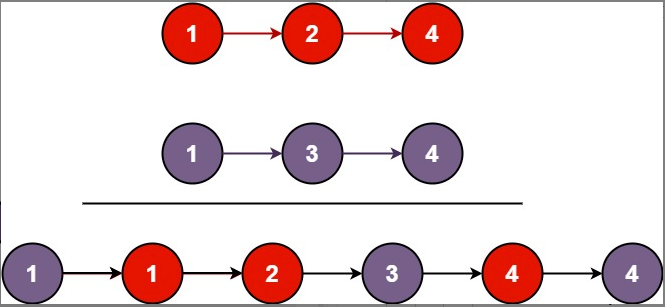

## 第一周作业

### 1. 合并两个有序链表

> https://leetcode.cn/problems/merge-two-sorted-lists/

将两个升序链表合并为一个新的 **升序** 链表并返回。新链表是通过拼接给定的两个链表的所有节点组成的。

**示例 1：**



```shell
输入：l1 = [1,2,4], l2 = [1,3,4]
输出：[1,1,2,3,4,4]
```

**示例 2：**

```shell
输入：l1 = [], l2 = []
输出：[]
```

**示例 3：**

```shell
输入：l1 = [], l2 = [0]
输出：[0]
```

```shell
class Solution {
public:
    ListNode* mergeTwoLists(ListNode* list1, ListNode* list2) {
        ListNode* head = new ListNode (0, nullptr);
        ListNode* last = head;

        ListNode* l1 = list1;
        ListNode* l2 = list2;
        while (l1 || l2)
        {
            if(!l1)
            {
                last->next = l2;
                l2 = l2->next;
                last = last->next;
                continue;
            }
            if(!l2)
            {
                last->next = l1;
                l1 = l1->next;
                last = last->next;
                continue;
            }
            if(l1->val > l2->val)
            {
                last->next = l2;
                l2 = l2->next;
            }
            else
            {
                last->next = l1;
                l1 = l1->next;
            }
            if(last->next)
            {
                last = last->next;
            }
        }
        return head->next;
    }
};
```

